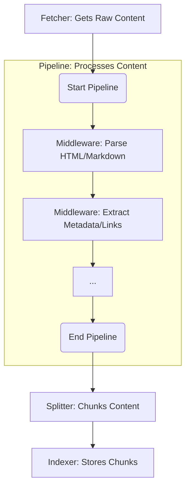

# Documentation MCP Server Architecture

## Overview

The Documentation MCP Server provides a unified system for scraping, storing, and searching documentation. It offers two main interfaces: a Command Line Interface (CLI) and a Model Context Protocol (MCP) Server.

### Key Technologies

The project uses:

- **Build Tool:** Vite
- **Testing:** Vitest
- **Web Interface:** HTMX, AlpineJS
- **Core Logic:** LangChain.js for embedding generation

### Code Conventions

- Class files use `PascalCase` (e.g., `PipelineManager.ts`).
- Other files use `kebab-case` or `camelCase` (e.g., `index.ts`, `scraper-service.ts`).
- Avoid `any` types; prefer `unknown` or specific types.

### Directory Structure

```
src/
├── index.ts                         # Unified CLI, MCP Server, and Web entry point
├── mcp/                             # MCP server implementation details
├── pipeline/                        # Asynchronous job processing pipeline
│   ├── PipelineManager.ts           # Manages job queue, concurrency, state
│   └── PipelineWorker.ts            # Executes a single pipeline job
├── scraper/                         # Web scraping implementation
│   ├── strategies/                  # Scraping strategies for different sources
│   ├── fetcher/                     # Content fetching abstractions
│   ├── middleware/                  # Individual middleware implementations
│   ├── pipelines/                   # HTML and markdown pipelines
│   └── ...
├── splitter/                        # Document splitting and chunking
├── store/                           # Document storage and retrieval
│   ├── DocumentManagementService.ts # Manages document storage and updates
│   ├── DocumentRetrieverService.ts  # Handles document retrieval and context
│   ├── DocumentStore.ts             # Low-level database interactions
│   └── ...
├── tools/                           # Core functionality tools
├── types/                           # Shared type definitions
└── utils/                           # Common utilities and helpers
    ├── config.ts                    # Centralized configuration constants
    ├── logger.ts                    # Centralized logging system
    └── ...
```

## Configuration Management

Default configuration values for the server and its components are defined as constants within `src/utils/config.ts`. This centralizes configuration and simplifies adjustments.

## Core Components Interaction

The system's core functionality revolves around how `scraper`, `fetcher`, `middleware`, `pipeline`, and `splitter` work together to process documentation.

### Scraper, Fetcher, Middleware, and Pipeline

The scraping process is modular and handles various content sources:

- **Content Sources**: Web (HTTP/HTTPS), local filesystem (file://), and package registries (npm, PyPI).

The content processing flow is as follows:

1.  **Fetcher**: Retrieves `RawContent` (raw content, MIME type, charset, URL) from a source.
2.  **Middleware**: `RawContent` is transformed into `MiddlewareContext` and passes through a series of `ContentProcessorMiddleware` components. Each middleware performs a specific task (e.g., parsing HTML, extracting metadata, converting to Markdown).
3.  **Pipeline**: `ContentProcessorMiddleware` components are organized into `ContentPipeline` implementations (e.g., `HtmlPipeline`, `MarkdownPipeline`) based on content type. A `scraper` strategy selects the appropriate pipeline.
4.  **Splitter**: After processing by the pipeline, the content is sent to a `splitter` which breaks it into smaller, manageable chunks for indexing.



## Tools Layer

The `tools/` directory contains modular implementations of core functionality, ensuring features are shared and reused across interfaces (CLI, MCP, Web). Business logic is implemented once, simplifying testing and maintenance.

### Tool Architecture

Tools operate on a unified data model where `PipelineManager` serves as the primary data source:

- **Job Management Tools**: Access comprehensive job information directly from the pipeline manager, including status, progress, and stored configuration.
- **Library Management Tools**: Interact with the document store for library and version operations.
- **Search Tools**: Query the document store with embedding-based semantic search.

The tools layer eliminates the need for complex data correlation by using the write-through architecture where pipeline jobs contain all necessary database state.

Common tools include:

- Documentation scraping with configuration persistence
- Search capabilities across indexed content
- Library version management with status tracking
- Job management (listing, status monitoring, cancellation)
- Document management operations
- URL fetching and conversion to Markdown

Both the CLI and MCP server directly use these tools. The Web interface also interacts with these tools to provide its functionality.

## Pipeline Architecture

The document processing is managed by an asynchronous, queue-based system with persistent job state:

- **`PipelineManager`**: Manages a queue of jobs (e.g., scraping tasks), controls concurrency, tracks job status, and maintains write-through synchronization between in-memory job state and database persistence.
- **`PipelineWorker`**: Executes individual jobs from the queue, orchestrating the scraping and storage of documents while reporting progress through callbacks.

The pipeline uses a write-through architecture where `PipelineJob` objects serve as the single source of truth, containing both runtime state and database fields. All status and progress updates are immediately synchronized to the database, ensuring data consistency and enabling recovery after server restarts.

### Job State Management

Jobs progress through defined states (`QUEUED`, `RUNNING`, `COMPLETED`, `FAILED`, `CANCELLED`) with automatic database persistence. Each job stores:

- **Status Information**: Current state, error messages, timestamps
- **Progress Tracking**: Pages processed, total pages, completion percentage
- **Scraper Configuration**: Original URL, scraping parameters for reproducible re-indexing
- **Database References**: Version ID and library information for data correlation

The system automatically recovers pending jobs after server restarts by loading database state back into memory.

## Document Storage

The project uses SQLite for document storage with a normalized schema design. Database schema changes are managed through sequential SQL migrations located in the `db/migrations/` directory.

The database file (`documents.db`) location is determined dynamically: it first checks for a `.store` directory in the current project, then defaults to an OS-specific application data directory for persistence.

### Database Schema

The storage layer uses a normalized design with separate tables:

- **`libraries`**: Library metadata and organization
- **`versions`**: Version tracking with comprehensive status and configuration storage
- **`documents`**: Document content with embeddings and metadata

The `versions` table serves as the central hub for job state management, storing indexing status, progress information, error messages, and scraper configuration. This enables persistent job queues, progress tracking, and reproducible re-indexing with identical parameters.

Documents are stored with URLs and sequential ordering to maintain source context for search results. Document embeddings are generated by the `EmbeddingFactory` (`src/store/embeddings/EmbeddingFactory.ts`) using LangChain.js, supporting various providers and ensuring consistent 1536-dimensional vectors for database compatibility.

### Document Management and Retrieval

The document storage and retrieval system is divided into two main services:

- **`DocumentManagementService`**: Manages documents within the store, handling additions, deletions, updates, and finding best matching library versions.
- **`DocumentRetrieverService`**: Focuses on retrieving documents and providing contextual information, including searching and fetching related content (e.g., parent, child, sibling chunks).

## Web Interface

The web interface provides a GUI for interacting with the server, built with a server-side rendered architecture using Fastify, `@kitajs/html` for JSX rendering, HTMX for dynamic updates, Tailwind/Flowbite for styling, and AlpineJS for client-side interactivity.

### Component Structure

The web interface is organized into:

- **Routes (`src/web/routes/`)**: Handle data fetching using core Tools and compose the UI.
- **Components (`src/web/components/`)**: Reusable JSX components for rendering specific UI parts.

### Real-time Updates

The web interface provides real-time job monitoring through HTMX polling mechanisms:

- **Job Status Display**: Components automatically poll for job updates every 3 seconds, showing live progress bars and status changes.
- **Progress Visualization**: Real-time page count updates during scraping operations with visual progress indicators.
- **Status Synchronization**: UI state reflects the write-through architecture, displaying current job state from the pipeline manager.

### AlpineJS and HTMX Interaction Pattern

When using AlpineJS with HTMX, avoid calling the global `htmx` object directly from Alpine event handlers (`x-on:`). Instead, dispatch a standard browser `CustomEvent` from the Alpine component, and configure `hx-trigger` on the same element to listen for this event. This decouples Alpine's scope from HTMX.

## Interface-Specific Adapters

- **Unified Entry Point (`src/index.ts`)**: This is the primary entry point for the application, responsible for initializing shared services and routing execution to either CLI commands, the MCP server, or the web interface based on the provided arguments.
- **MCP Server Logic (`src/mcp/index.ts` and `src/mcp/tools.ts`)**: Implements the MCP protocol, exposing core functionalities from the `tools/` directory as MCP tools.

Common MCP tools include:

- `scrape_docs`: Starts a scraping job and stores configuration for future re-indexing.
- `search_docs`: Searches indexed documentation.
- `list_libraries`: Lists indexed libraries with version status information.
- `list_jobs`: Lists active and recent pipeline jobs with comprehensive status.
- `get_job_info`: Retrieves detailed job status including progress and configuration.
- `cancel_job`: Cancels a running or queued job.

## Progress Reporting

A unified progress reporting system provides real-time job monitoring through write-through architecture:

- **Job Status Updates**: State changes (`QUEUED` → `RUNNING` → `COMPLETED`) with automatic database persistence.
- **Progress Tracking**: Real-time page count updates during scraping operations, visible in web UI through HTMX polling.
- **Error Handling**: Detailed error messages stored with failed jobs for debugging and user feedback.
- **Configuration Storage**: Scraper parameters stored with each version for reproducible re-indexing.

The `PipelineManager` serves as the single source of truth for all job information, maintaining synchronization between in-memory state and database persistence. Progress updates flow from workers through callbacks to the manager, which immediately updates both memory and database to ensure consistency.

## Logging Strategy

A centralized logging system (`utils/logger.ts`) provides hierarchical logging for clear visibility and consistent error reporting across layers:

1.  **Tools Layer**: User-facing operations, final results.
2.  **Core Components**: Operational logs, store management.
3.  **Strategy Layer**: Detailed progress (e.g., page crawling), error conditions.

## Testing Conventions

Our testing philosophy emphasizes verifying public contracts and ensuring tests are robust and maintainable.

### 1. Test Public API Behavior

- Focus tests on public methods: verify correct outputs or observable side effects for given inputs.
- Avoid assertions on internal implementation details (private methods, internal state). Tests should remain resilient to refactoring.

### 2. Mocking Principles

- Mock only true external dependencies (e.g., databases, external APIs, file system).
- When mocking modules with Vitest, be aware that `vi.mock` is hoisted. Define top-level mock functions/objects before the `vi.mock` call, and assign them within the mock factory.
- Set default behaviors for mocks globally; override them locally in tests or describe blocks as needed.
- Use shared spies for repeated calls (e.g., a database statement's `.all()`), and reset them in `beforeEach`.

### 3. Test Structure & Assertions

- Organize related tests with `describe`, and use `beforeEach`/`afterEach` for setup and cleanup.
- Assert expected return values and observable side effects. Use `expect(...).resolves/.rejects` for async code.
- Only assert direct calls to mocks if that interaction is a key part of the contract being tested.

These guidelines help ensure tests are clear, maintainable, and focused on the system's observable behavior.

## Releasing

The project uses `semantic-release` and `Conventional Commits` for automated releases. Releases are triggered manually via GitHub Actions.

## Future Considerations

When adding new functionality or scraping capabilities, implement core logic as new tools, design for efficient data handling, and integrate with existing pipelines and strategies.
