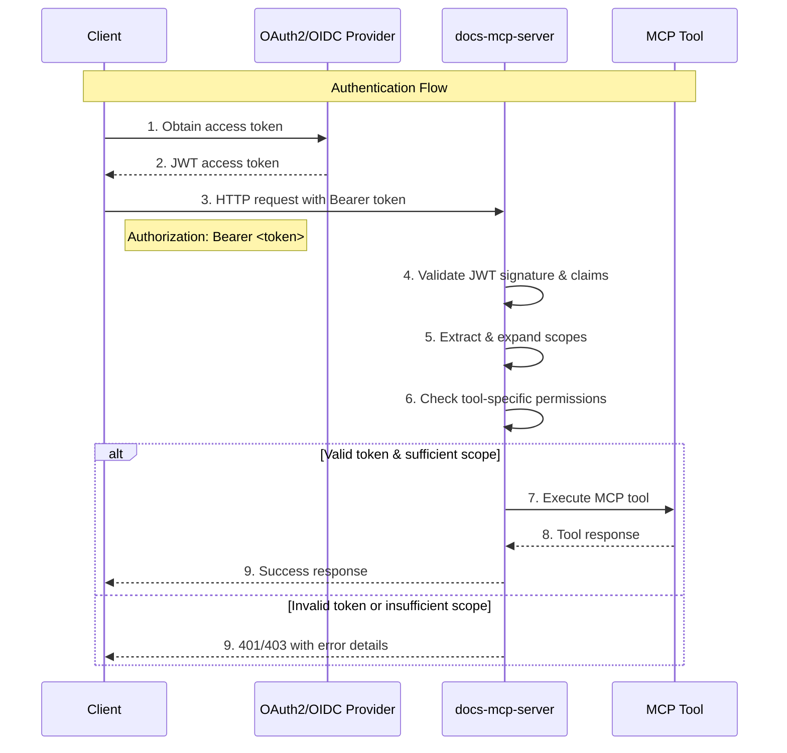

# OAuth2/OIDC Authentication

## Overview

The docs-mcp-server supports optional OAuth2/OIDC authentication for HTTP endpoints, providing enterprise-grade security while maintaining a frictionless local development experience. Authentication is disabled by default and follows RFC 9728 for OAuth2 protected resource specification.

## Architecture

The authentication system uses a three-tier scope model with inheritance, provider-agnostic OAuth2/OIDC integration, and granular tool-level access control.

### Scope Hierarchy

The system implements a hierarchical scope model where higher-level scopes inherit permissions from lower-level scopes:

- **`read:docs`** - Access to documentation search and retrieval operations
- **`write:docs`** - Document ingestion capabilities (includes `read:docs`)
- **`admin:jobs`** - Job management and administrative operations (includes all scopes)

### Authentication Flow



## Configuration

Authentication is configured through CLI arguments, environment variables, or configuration files with the following precedence: CLI flags > environment variables > defaults.

### CLI Arguments

```bash
# Enable authentication with OAuth2/OIDC provider
npx docs-mcp-server \
  --auth-enabled \
  --auth-provider-url "https://auth.company.com" \
  --auth-resource-id "https://api.company.com" \
  --auth-scopes read:docs,write:docs
```

### Environment Variables

```bash
export MCP_AUTH_ENABLED=true
export MCP_AUTH_PROVIDER_URL="https://auth.company.com"
export MCP_AUTH_RESOURCE_ID="https://api.company.com"
export MCP_AUTH_SCOPES="read:docs,write:docs"
```

### Configuration Options

| Option       | CLI Flag              | Environment Variable    | Description                              |
| ------------ | --------------------- | ----------------------- | ---------------------------------------- |
| Enable Auth  | `--auth-enabled`      | `MCP_AUTH_ENABLED`      | Enable OAuth2/OIDC authentication        |
| Provider URL | `--auth-provider-url` | `MCP_AUTH_PROVIDER_URL` | OAuth2/OIDC discovery endpoint           |
| Resource ID  | `--auth-resource-id`  | `MCP_AUTH_RESOURCE_ID`  | JWT audience claim (resource identifier) |
| Scopes       | `--auth-scopes`       | `MCP_AUTH_SCOPES`       | Comma-separated list of enabled scopes   |

## Tool-to-Scope Mapping

Each MCP tool requires specific scope permissions:

### Read Operations (`read:docs`)

- `list_libraries` - List indexed documentation libraries
- `search_docs` - Search within documentation
- `fetch_url` - Retrieve content from URLs
- `find_version` - Find library version information
- `get_job_info` - View job status and details
- `list_jobs` - List processing jobs

### Write Operations (`write:docs`)

- `scrape_docs` - Index new documentation content

### Administrative Operations (`admin:jobs`)

- `cancel_job` - Cancel running jobs
- `remove_docs` - Remove indexed documentation
- `clear_completed_jobs` - Clean up completed jobs

## Security Features

### JWT Validation

- **Signature Verification**: Cryptographic validation using provider's public keys
- **Claim Validation**: Issuer, audience, and expiration time verification
- **Scope Enforcement**: Tool-level permission checking

### Error Handling

- **401 Unauthorized**: Missing or invalid authentication token
- **403 Forbidden**: Valid token but insufficient scope permissions
- **WWW-Authenticate Header**: RFC 6750 compliant challenge responses

### Fail-Safe Design

- **Disabled by Default**: No authentication required for local development
- **Localhost Bypass**: Local connections work without authentication
- **Graceful Degradation**: Invalid configuration logs errors but doesn't crash

## Protected Resource Metadata

The server exposes RFC 9728 compliant metadata at `/.well-known/oauth-protected-resource`:

```json
{
  "resource_registration_endpoint": null,
  "scopes_supported": ["read:docs", "write:docs", "admin:jobs"],
  "bearer_methods_supported": ["header"],
  "resource_documentation": null
}
```

## Usage Examples

### Development (No Auth)

```bash
# Start server without authentication
npx docs-mcp-server --port 6280
```

### Production with Auth

```bash
# Start with OAuth2/OIDC authentication
npx docs-mcp-server \
  --port 6280 \
  --auth-enabled \
  --auth-provider-url "https://keycloak.company.com/realms/api" \
  --auth-resource-id "https://docs-api.company.com" \
  --auth-scopes "read:docs,write:docs,admin:jobs"
```

### Client Authentication

```javascript
// Obtain token from your OAuth2 provider
const token = await getAccessToken();

// Use token in requests
const response = await fetch("http://localhost:6280/mcp", {
  method: "POST",
  headers: {
    Authorization: `Bearer ${token}`,
    "Content-Type": "application/json",
  },
  body: JSON.stringify({
    jsonrpc: "2.0",
    method: "search_docs",
    params: { library: "react", query: "hooks" },
    id: 1,
  }),
});
```

## Integration Patterns

### OAuth2 Providers

The system works with any RFC 6749 compliant OAuth2/OIDC provider:

- **Auth0**: Use tenant domain as provider URL
- **Keycloak**: Use realm-specific issuer URL
- **Azure AD**: Use tenant-specific v2.0 endpoint
- **Google**: Use Google's OAuth2 endpoints
- **Clerk**: Use your Clerk domain for provider URL
- **Custom**: Any provider supporting JWT access tokens

#### Clerk Configuration Example

```bash
# Clerk setup
npx docs-mcp-server \
  --auth-enabled \
  --auth-provider-url "https://your-app.clerk.accounts.dev" \
  --auth-resource-id "https://docs-api.your-domain.com" \
  --auth-scopes "read:docs,write:docs,admin:jobs"
```

**Clerk JWT Template Configuration:**
Configure your JWT template in Clerk dashboard to include the resource ID as audience:

```json
{
  "aud": "https://docs-api.your-domain.com",
  "scope": "{{user.publicMetadata.scopes}}"
}
```

**Resource ID Requirements:**

- Must be a valid absolute URL
- Must use HTTPS protocol (except localhost for development)
- Used as the JWT audience claim for validation
- Can be any unique identifier for your API (e.g., `https://docs-api.your-domain.com`)

### API Gateway Integration

When deployed behind an API gateway with authentication:

1. Configure the gateway to validate tokens
2. Forward validated requests with user context
3. Use gateway-provided claims for authorization
4. Optionally disable server-side auth validation

## Troubleshooting

### Common Issues

**401 Unauthorized**

- Check token is included in Authorization header
- Verify token hasn't expired
- Confirm provider URL and resource ID configuration
- Ensure resource ID matches the JWT audience claim

**403 Forbidden**

- Check user has required scopes in token
- Verify scope names match exactly
- Review tool-to-scope mapping

**500 Internal Server Error**

- Check provider discovery endpoint is accessible
- Verify provider URL configuration
- Review server logs for detailed error messages

### Debug Logging

Enable debug logging to troubleshoot authentication issues:

```bash
DEBUG=mcp:auth npx docs-mcp-server --auth-enabled --auth-provider-url "..."
```

## Security Considerations

### Token Security

- Use HTTPS in production environments
- Implement proper token storage in clients
- Consider token refresh strategies for long-running operations
- Monitor token expiration and handle renewal

### Network Security

- Deploy behind TLS termination
- Consider API rate limiting
- Implement proper CORS policies for web clients
- Use secure OAuth2 flows (Authorization Code with PKCE)

### Scope Management

- Follow principle of least privilege
- Regularly audit scope assignments
- Consider time-limited scope grants
- Monitor scope usage patterns
