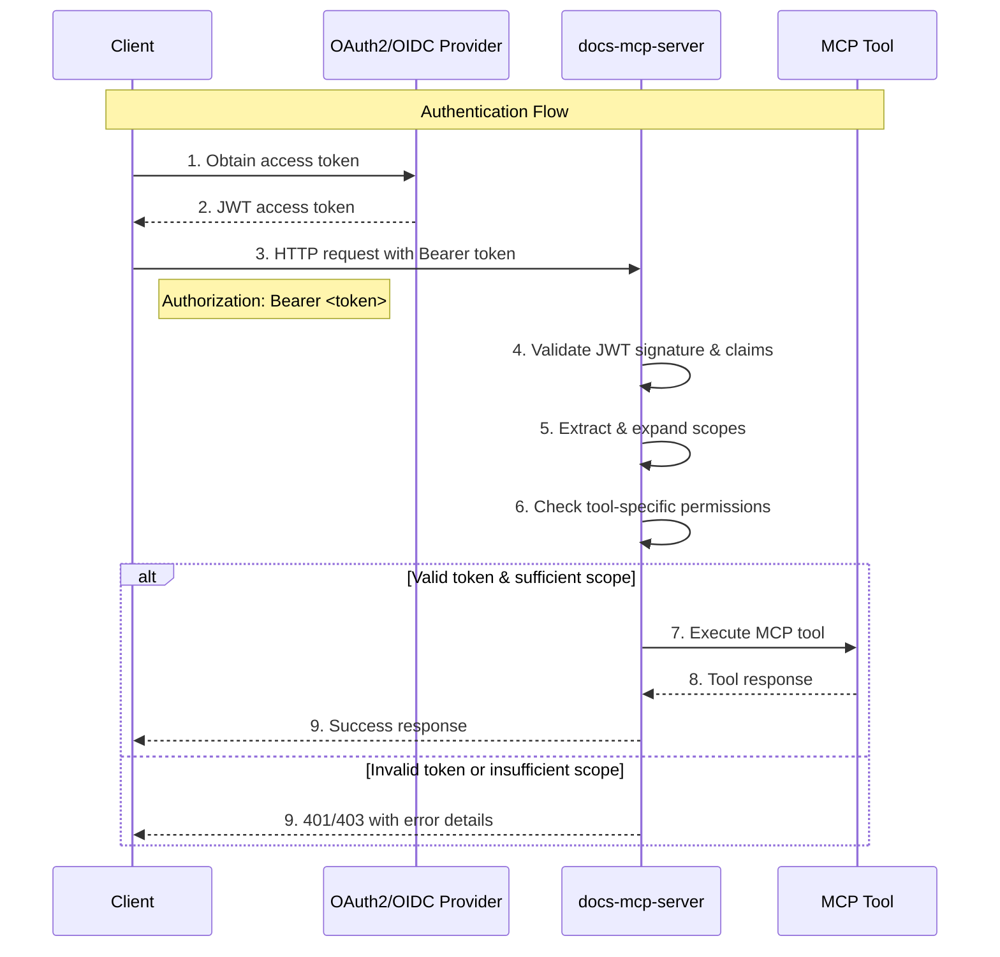
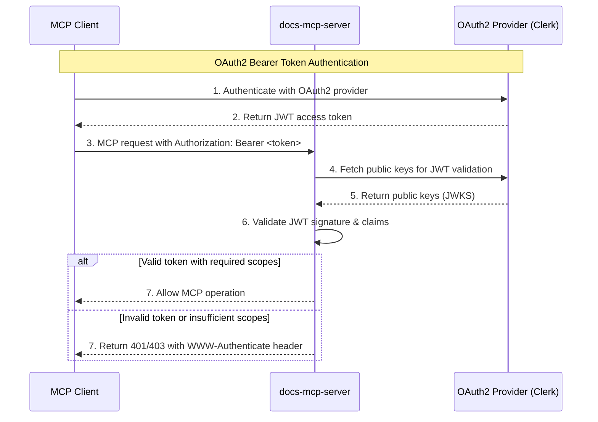

# OAuth2/OIDC Authentication

## Overview

The Docs MCP Server supports optional OAuth2/OIDC authentication for HTTP endpoints, providing enterprise-grade security while maintaining a frictionless local development experience. Authentication is disabled by default and follows RFC 9728 for OAuth2 protected resource specification.

**Important**: The Docs MCP Server is an **OAuth2 protected resource**, not an OAuth2 authorization server. It relies on external OAuth2/OIDC providers (such as Auth0, Clerk, Keycloak, or Azure AD) for authentication and authorization. The server validates JWT tokens issued by these providers but does not issue tokens itself.

## Architecture

The authentication system uses a three-tier scope model with inheritance, provider-agnostic OAuth2/OIDC integration, and granular tool-level access control.

**Architecture Overview**: The Docs MCP Server acts as an OAuth2 **protected resource** that validates JWT access tokens issued by external OAuth2/OIDC providers. It does not implement an authorization server - all token issuance, user authentication, and consent flows are handled by your chosen OAuth2 provider (Auth0, Clerk, Keycloak, etc.).

### Scope Hierarchy

The system implements a hierarchical scope model where higher-level scopes inherit permissions from lower-level scopes:

- **`read:docs`** - Access to documentation search and retrieval operations
- **`write:docs`** - Document ingestion capabilities (includes `read:docs`)
- **`admin:jobs`** - Job management and administrative operations (includes all scopes)

### Authentication Flow



## Configuration

Authentication is configured by pointing the Docs MCP Server to your external OAuth2/OIDC provider. Configure through CLI arguments, environment variables, or configuration files with the following precedence: CLI flags > environment variables > defaults.

**Setup Steps**:

1. **Set up your OAuth2 provider** (Auth0, Clerk, Keycloak, etc.) with appropriate scopes and JWT configuration
2. **Configure the Docs MCP Server** to validate tokens from that provider using the settings below

### CLI Arguments

```bash
# Configure Docs MCP Server to validate tokens from your OAuth2/OIDC provider
npx docs-mcp-server \
  --auth-enabled \
  --auth-issuer-url "https://auth.company.com" \
  --auth-audience "https://api.company.com" \
  --auth-scopes read:docs,write:docs
```

### Environment Variables

```bash
# Configure Docs MCP Server via environment variables
export DOCS_MCP_AUTH_ENABLED=true
export DOCS_MCP_AUTH_ISSUER_URL="https://auth.company.com"
export DOCS_MCP_AUTH_AUDIENCE="https://api.company.com"
export DOCS_MCP_AUTH_SCOPES="read:docs,write:docs"
```

### Configuration Options

| Option      | CLI Flag            | Environment Variable       | Description                                               |
| ----------- | ------------------- | -------------------------- | --------------------------------------------------------- |
| Enable Auth | `--auth-enabled`    | `DOCS_MCP_AUTH_ENABLED`    | Enable OAuth2/OIDC token validation                       |
| Issuer URL  | `--auth-issuer-url` | `DOCS_MCP_AUTH_ISSUER_URL` | OAuth2/OIDC discovery endpoint of your external provider  |
| Audience    | `--auth-audience`   | `DOCS_MCP_AUTH_AUDIENCE`   | JWT audience claim (identifies this protected resource)   |
| Scopes      | `--auth-scopes`     | `DOCS_MCP_AUTH_SCOPES`     | Comma-separated list of scopes this server will recognize |

## OAuth2/OIDC Setup

The Docs MCP Server supports OAuth2/OIDC authentication for securing MCP endpoints. Token validation is handled through standard JWT validation using the provider's public keys.

**Note**: You must configure an external OAuth2/OIDC provider (such as Clerk, Auth0, Keycloak, or Azure AD) before enabling authentication. The Docs MCP Server validates tokens but does not issue them.

### How It Works

OAuth2 authentication follows the standard bearer token pattern:



### Server Configuration

To enable OAuth2 authentication, configure the Docs MCP Server to connect to your OAuth2 provider:

```bash
# Configure Docs MCP Server to validate tokens from your OAuth2 provider
npx docs-mcp-server \
  --auth-enabled \
  --auth-issuer-url "https://your-app.clerk.accounts.dev" \
  --auth-audience "https://docs-api.your-domain.com" \
  --auth-scopes "read:docs,write:docs"
```

### OAuth2 Provider Setup

**Prerequisite**: You must first set up an OAuth2/OIDC provider separately. The following examples show how to configure popular providers to work with the Docs MCP Server.

#### Clerk Configuration

**In your Clerk dashboard** (separate setup required):

1. **Create Application** in Clerk dashboard:

   - Application Type: "Web Application" or "Single Page Application"

2. **Configure JWT Template** to include the resource ID in audience claim:

   ```json
   {
     "aud": "https://docs-api.your-domain.com",
     "scope": "{{user.publicMetadata.scopes}}"
   }
   ```

3. **Set User Scopes** in user metadata:
   - Add `scopes` to user's `publicMetadata`
   - Example: `["read:docs", "write:docs", "admin:jobs"]`

**In your Docs MCP Server configuration**:

```bash
# Point Docs MCP Server to your Clerk instance
npx docs-mcp-server \
  --auth-enabled \
  --auth-issuer-url "https://your-app.clerk.accounts.dev" \
  --auth-audience "https://docs-api.your-domain.com" \
  --auth-scopes "read:docs,write:docs,admin:jobs"
```

### Protected Resource Metadata

The server exposes RFC 9728 compliant metadata at `/.well-known/oauth-protected-resource`:

```json
{
  "resource": "https://docs-api.your-domain.com",
  "authorization_servers": ["https://your-app.clerk.accounts.dev"],
  "scopes_supported": ["read:docs", "write:docs", "admin:jobs"],
  "resource_name": "Documentation MCP Server",
  "resource_documentation": "https://github.com/arabold/docs-mcp-server#readme",
  "bearer_methods_supported": ["header"]
}
```

### MCP Client Integration

MCP clients can authenticate using standard OAuth2 flows:

1. **Discovery**: Fetch `/.well-known/oauth-protected-resource` for metadata
2. **Authentication**: Obtain JWT token from the OAuth2 provider
3. **API Access**: Include `Authorization: Bearer <token>` header in MCP requests

**Dynamic Client Registration**: When using OAuth2 providers that support DCR (like Clerk), MCP clients can automatically register and obtain authorization without manual client configuration. The DCR workflow is handled entirely by the OAuth2 provider - the Docs MCP Server acts as a protected resource that validates the resulting JWT tokens.

## Tool-to-Scope Mapping

Each MCP tool requires specific scope permissions:

### Read Operations (`read:docs`)

- `list_libraries` - List indexed documentation libraries
- `search_docs` - Search within documentation
- `fetch_url` - Retrieve content from URLs
- `find_version` - Find library version information
- `get_job_info` - View job status and details
- `list_jobs` - List processing jobs

### Write Operations (`write:docs`)

- `scrape_docs` - Index new documentation content

### Administrative Operations (`admin:jobs`)

- `cancel_job` - Cancel running jobs
- `remove_docs` - Remove indexed documentation
- `clear_completed_jobs` - Clean up completed jobs

## Security Features

### JWT Validation

- **Signature Verification**: Cryptographic validation using provider's public keys
- **Claim Validation**: Issuer, audience, and expiration time verification
- **Scope Enforcement**: Tool-level permission checking

### Error Handling

- **401 Unauthorized**: Missing or invalid authentication token
- **403 Forbidden**: Valid token but insufficient scope permissions
- **WWW-Authenticate Header**: RFC 6750 compliant challenge responses

### Fail-Safe Design

- **Disabled by Default**: No authentication required for local development
- **Localhost Bypass**: Local connections work without authentication
- **Graceful Degradation**: Invalid configuration logs errors but doesn't crash

## Usage Examples

### Development (No Auth)

```bash
# Start server without authentication
npx docs-mcp-server --port 6280
```

### Production with Auth

```bash
# Configure Docs MCP Server to validate tokens from your OAuth2/OIDC provider
npx docs-mcp-server \
  --port 6280 \
  --auth-enabled \
  --auth-issuer-url "https://keycloak.company.com/realms/api" \
  --auth-audience "https://docs-api.company.com" \
  --auth-scopes "read:docs,write:docs,admin:jobs"
```

### Client Authentication

```javascript
// Obtain token from your OAuth2 provider
const token = await getAccessToken();

// Use token in requests
const response = await fetch("http://localhost:6280/mcp", {
  method: "POST",
  headers: {
    Authorization: `Bearer ${token}`,
    "Content-Type": "application/json",
  },
  body: JSON.stringify({
    jsonrpc: "2.0",
    method: "search_docs",
    params: { library: "react", query: "hooks" },
    id: 1,
  }),
});
```

## Integration Patterns

### OAuth2 Providers

The Docs MCP Server works with any RFC 6749 compliant OAuth2/OIDC provider as an external authentication service. You must set up one of these providers separately:

- **Auth0**: Use tenant domain as provider URL
- **Keycloak**: Use realm-specific issuer URL
- **Azure AD**: Use tenant-specific v2.0 endpoint
- **Google**: Use Google's OAuth2 endpoints
- **Clerk**: Use your Clerk domain for provider URL
- **Custom**: Any provider supporting JWT access tokens

The Docs MCP Server validates tokens issued by these providers but does not replace them.

#### Clerk Configuration Example

```bash
# Clerk setup
npx docs-mcp-server \
  --auth-enabled \
  --auth-issuer-url "https://your-app.clerk.accounts.dev" \
  --auth-audience "https://docs-api.your-domain.com" \
  --auth-scopes "read:docs,write:docs,admin:jobs"
```

**Clerk JWT Template Configuration:**
Configure your JWT template in Clerk dashboard to include the resource ID as audience:

```json
{
  "aud": "https://docs-api.your-domain.com",
  "scope": "{{user.publicMetadata.scopes}}"
}
```

**Resource ID Requirements:**

- Must be a valid URI (URL or URN)
- **URL examples**: `https://docs-api.your-domain.com`, `http://localhost:6280` (dev only)
- **URN examples**: `urn:docs-mcp-server:api`, `urn:company:service`
- Used as the JWT audience claim for validation
- Should be unique and not conflict with your actual server URL

### API Gateway Integration

When deployed behind an API gateway with authentication:

1. Configure the gateway to validate tokens
2. Forward validated requests with user context
3. Use gateway-provided claims for authorization
4. Optionally disable server-side auth validation

## Troubleshooting

### Common Issues

**401 Unauthorized**

- Check token is included in Authorization header
- Verify token hasn't expired
- Confirm provider URL and resource ID configuration
- Ensure resource ID matches the JWT audience claim

**403 Forbidden**

- Check user has required scopes in token
- Verify scope names match exactly
- Review tool-to-scope mapping

**500 Internal Server Error**

- Check provider discovery endpoint is accessible
- Verify provider URL configuration
- Review server logs for detailed error messages

### Debug Logging

Enable debug logging to troubleshoot authentication issues:

```bash
DEBUG=mcp:auth npx docs-mcp-server --auth-enabled --auth-issuer-url "..."
```

## Security Considerations

### Token Security

- Use HTTPS in production environments
- Implement proper token storage in clients
- Consider token refresh strategies for long-running operations
- Monitor token expiration and handle renewal

### Network Security

- Deploy behind TLS termination
- Consider API rate limiting
- Implement proper CORS policies for web clients
- Use secure OAuth2 flows (Authorization Code with PKCE)

### Scope Management

- Follow principle of least privilege
- Regularly audit scope assignments
- Consider time-limited scope grants
- Monitor scope usage patterns
